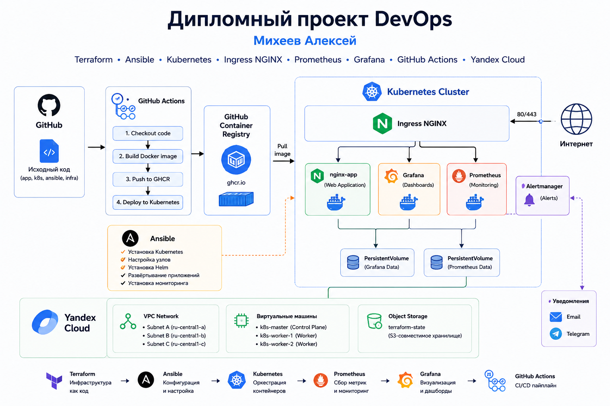
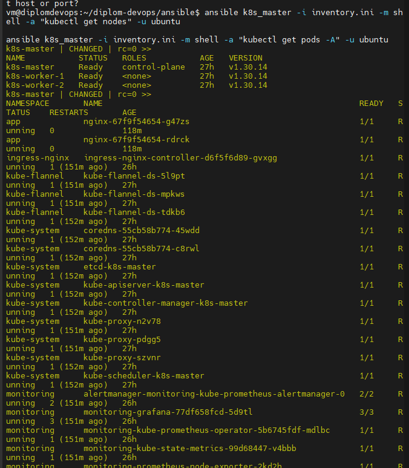
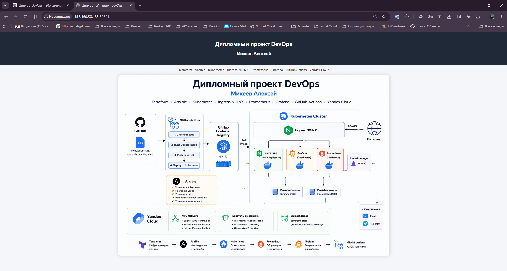
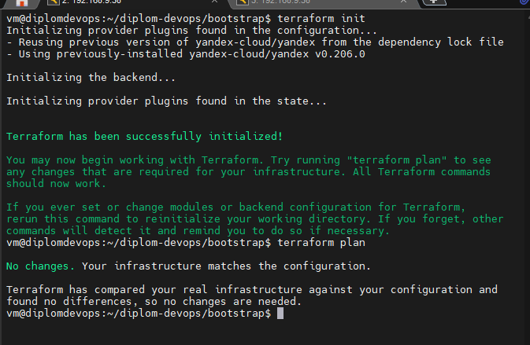
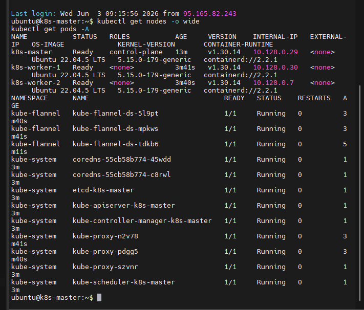
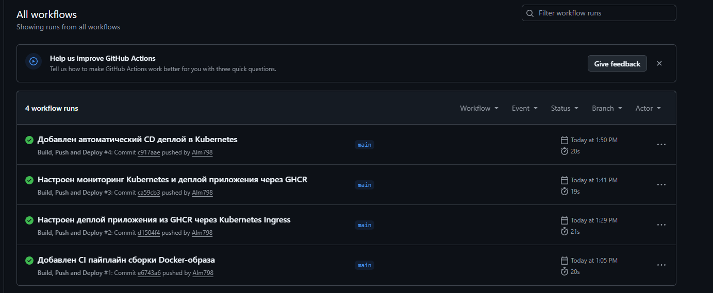
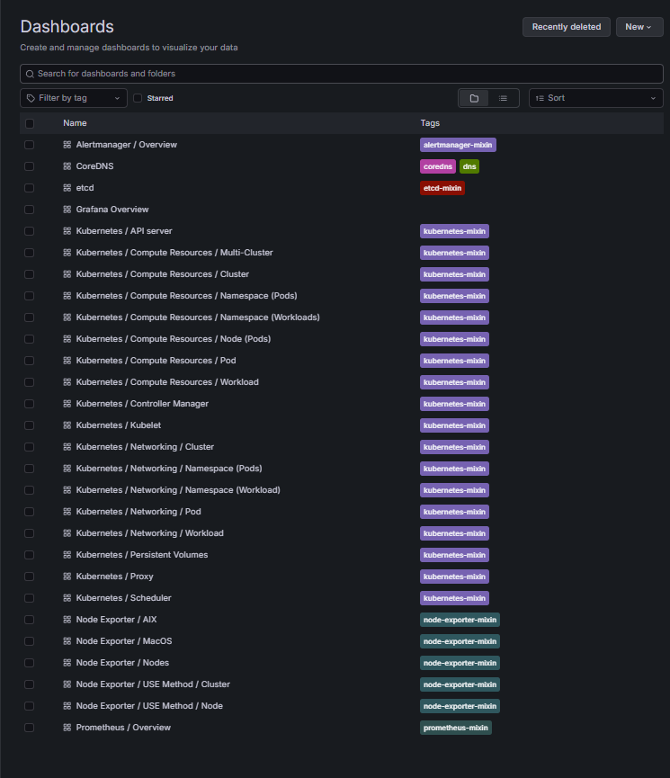
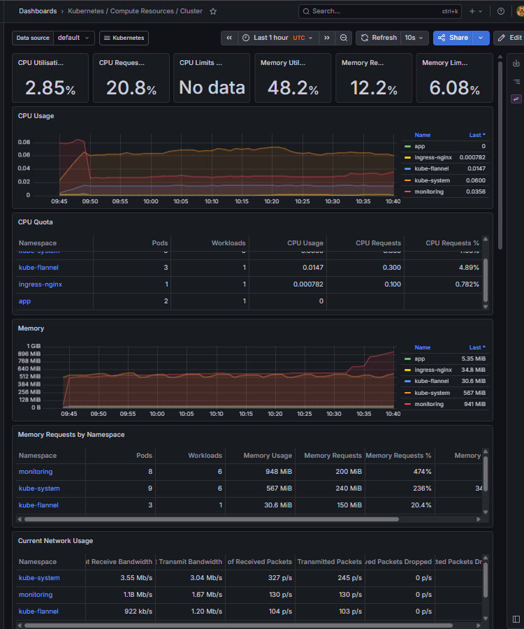
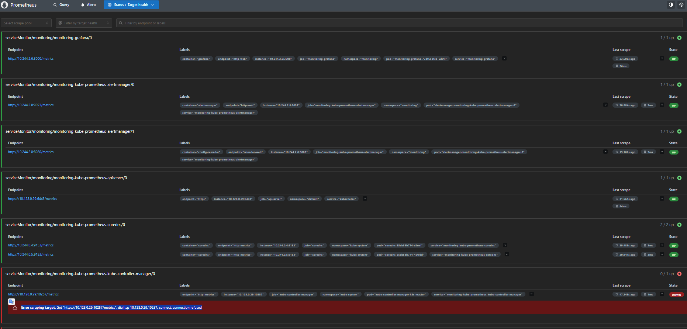

# Дипломный практикум DevOps в Yandex Cloud

## Автор

**Михеев Алексей**

---

# Цель проекта

Целью проекта является создание облачной инфраструктуры в Yandex Cloud и автоматизация полного жизненного цикла приложения с использованием современных DevOps-подходов.

В рамках проекта реализованы:

* Infrastructure as Code (Terraform)
* Автоматизация настройки инфраструктуры (Ansible)
* Kubernetes-кластер
* Контейнеризация приложения (Docker)
* CI/CD (GitHub Actions)
* Мониторинг (Prometheus + Grafana)
* Хранение образов в GitHub Container Registry (GHCR)

---

# Архитектурная схема проекта



---

# Используемые технологии

| Технология                | Назначение                             |
| ------------------------- | -------------------------------------- |
| Terraform                 | Создание инфраструктуры в Yandex Cloud |
| Yandex Cloud              | Облачная платформа                     |
| Kubernetes                | Оркестрация контейнеров                |
| Ansible                   | Автоматизация настройки кластера       |
| Docker                    | Контейнеризация приложения             |
| GitHub Actions            | CI/CD пайплайн                         |
| GitHub Container Registry | Хранилище Docker-образов               |
| NGINX Ingress Controller  | Публикация сервисов                    |
| Prometheus                | Сбор метрик                            |
| Grafana                   | Визуализация метрик                    |
| Alertmanager              | Управление уведомлениями               |

---

# Структура репозитория

```text
.
├── ansible/
│   ├── install-k8s.yml
│   ├── init-master.yml
│   ├── install-ingress.yml
│   ├── install-monitoring.yml
│   ├── deploy-nginx.yml
│   └── inventory.ini
│
├── app/
│   ├── Dockerfile
│   ├── index.html
│   └── architecture.png
│
├── bootstrap/
│   └── Terraform backend
│
├── infra/
│   ├── provider.tf
│   ├── network.tf
│   ├── k8s-vm.tf
│   └── outputs.tf
│
├── img/
│   └── Скриншоты проекта
│
└── .github/workflows/
    └── build.yml
```

---

# Реализованная инфраструктура

## Kubernetes Cluster

| Узел         | Роль          |
| ------------ | ------------- |
| k8s-master   | Control Plane |
| k8s-worker-1 | Worker Node   |
| k8s-worker-2 | Worker Node   |

Кластер развёрнут в Yandex Cloud с использованием Terraform и настроен через Ansible.

---

# Выполненные этапы

## 1. Подготовка облачной инфраструктуры

Создано:

* сервисный аккаунт Terraform
* S3 Backend для Terraform State
* VPC сеть
* подсеть
* виртуальные машины Kubernetes

---

## 2. Развертывание Kubernetes

Автоматизировано с помощью Ansible:

* установка containerd
* установка kubeadm
* инициализация master-узла
* подключение worker-узлов
* установка сетевого плагина Flannel

---

## 3. Установка Ingress NGINX

Развернут Ingress Controller:

```text
ingress-nginx
```

Обеспечивает публикацию приложений во внешний мир.

---

## 4. Развертывание мониторинга

Установлен стек мониторинга:

* Prometheus
* Grafana
* Alertmanager
* kube-state-metrics
* node-exporter

Мониторинг позволяет отслеживать:

* CPU
* RAM
* Pods
* Nodes
* Namespaces
* Сетевую активность

---

## 5. Контейнеризация приложения

Создан Docker-образ веб-приложения.

Dockerfile:

```dockerfile
FROM nginx:alpine

COPY . /usr/share/nginx/html/
```

---

## 6. Публикация приложения

Приложение развернуто в Kubernetes:

```text
Deployment
Service
Ingress
```

---

## 7. Реализация CI/CD

Настроен GitHub Actions Pipeline.

Сценарий работы:

```text
Git Push
    ↓
GitHub Actions
    ↓
Docker Build
    ↓
Push в GHCR
    ↓
Deploy в Kubernetes
    ↓
Rolling Update Deployment
```

Используется GitHub Container Registry:

```text
ghcr.io/alm798/devops-diplom:latest
```

---

# Мониторинг

## Grafana

В Grafana настроены готовые Kubernetes Dashboard:

* Kubernetes / Cluster
* Kubernetes / Node
* Kubernetes / Pod
* Kubernetes / Namespace
* Kubernetes / Networking

---

## Prometheus

Prometheus собирает метрики:

* Kubernetes API Server
* CoreDNS
* Node Exporter
* Grafana
* Alertmanager
* kube-state-metrics

---

# Проверка работоспособности

## Проверка кластера
Проверка состояния Kubernetes-кластера выполняется через Ansible с использованием inventory и удаленного выполнения команд kubectl на master-узле.
```bash

ansible k8s_master -i inventory.ini -m shell -a "kubectl get nodes" -u ubuntu

ansible k8s_master -i inventory.ini -m shell -a "kubectl get pods -A" -u ubuntu

ansible k8s_master -i inventory.ini -m shell -a \
"kubectl rollout status deployment/nginx -n app" \
-u ubuntu
```

## Проверка приложения

```bash
curl http://158.160.50.135:30591
```

## Проверка мониторинга

Grafana:

```text
http://158.160.50.135:30300/
```

Prometheus:

```text
http://158.160.50.135:9090/
```

---

# Скриншоты

## Созданная инфраструктура



## Kubernetes Cluster



## GitHub Actions



## Grafana Dashboard




## Prometheus Targets



## Веб-приложение


---

# Результат

В рамках дипломного проекта создана полностью автоматизированная инфраструктура в Yandex Cloud.

Реализованы:

* Infrastructure as Code
* Kubernetes
* Ansible Automation
* Docker
* GitHub Actions CI/CD
* GitHub Container Registry
* Prometheus
* Grafana
* Ingress NGINX

Все компоненты успешно развернуты и протестированы.
